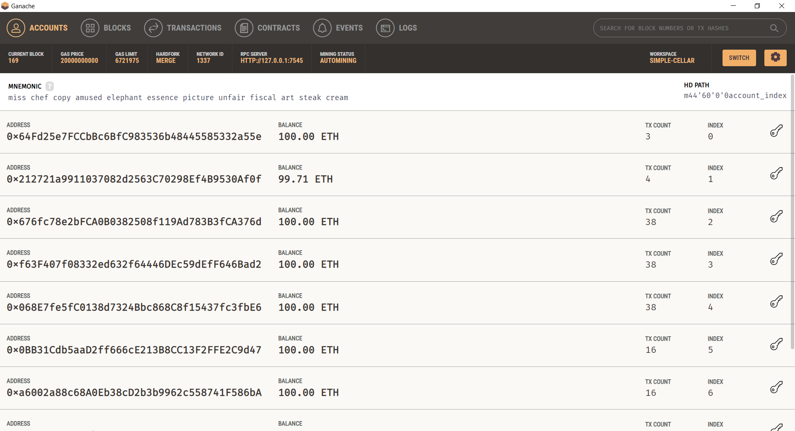
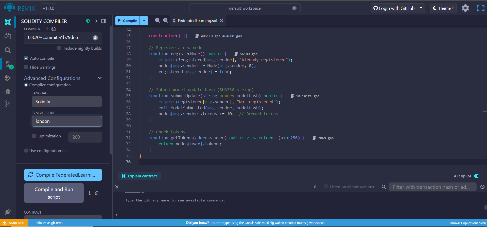
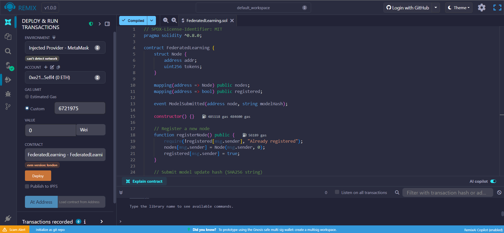
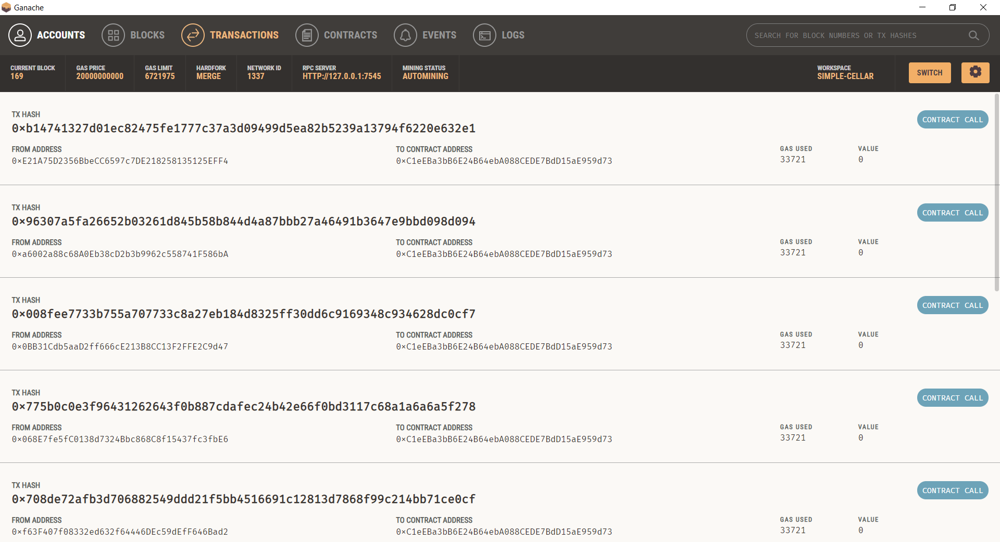
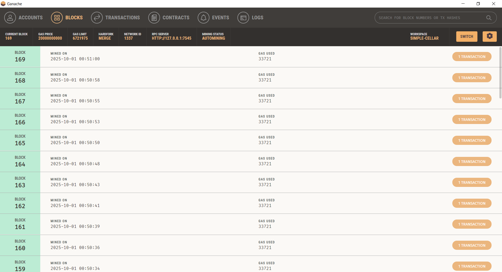

# Fair and Transparent Federated Learning with Blockchain

# 🏗️ Blockchain-Powered Federated Learning Prototype

This project demonstrates a **proof-of-concept system** for integrating **Federated Learning (FL)** with **Blockchain**.  
It ensures:
- ✅ Transparency (immutable logs of model updates)  
- ✅ Fairness (token-based incentives for participants)  
- ✅ Accountability (every update is verifiable via hash)  

The system uses:
- **Ganache** – local Ethereum blockchain simulator  
- **Remix IDE** – smart contract development  
- **MetaMask** – wallet interface connected to Ganache  
- **Python (PyTorch + web3.py)** – FL simulation and blockchain interaction  

---

## 🚀 Project Workflow

1. **Federated Learning Node (Python)** trains a model locally (MNIST).  
2. The **model weights** are hashed with SHA256.  
3. The **hash is submitted to blockchain** via smart contract.  
4. Smart contract **rewards tokens** to the node for contribution.  
5. All transactions are visible in **Ganache GUI**.


---

## ⚙️ Setup Instructions

### 1️⃣ Install Tools
- [Ganache](https://trufflesuite.com/ganache/) – local Ethereum blockchain  
- [MetaMask](https://metamask.io/) – browser wallet  
- [Remix IDE](https://remix.ethereum.org/) – Solidity development  
- [VS Code](https://code.visualstudio.com/) – Python IDE  

### 2️⃣ Configure Ganache + MetaMask
- Run **Ganache GUI** → note **RPC: http://127.0.0.1:7545** and **Chain ID (5777 or 1337)**  
- In **MetaMask**, add a new network:
    - Network Name: `Ganache Local`  
    - New RPC URL: `http://127.0.0.1:7545`  
    - Chain ID: `5777` or `1337` (as per Ganache)
    - Currency Symbol: `ETH`

- Import an account from Ganache into MetaMask using the private key.

### Ganache Dashboard

---

### 3️⃣ Deploy Smart Contract
- Open [Remix](https://remix.ethereum.org/).  
- Create file `FederatedLearning.sol` with contract code.  
- Compile with Solidity `0.8.x`.  
- Deploy using **Injected Provider - MetaMask**.  
- Confirm deployment in MetaMask.  

### Remix Compile View

### Remix Deploy View


### Ganache Transaction Log

### Ganache Blocks View


---

### 4️⃣ Python Environment
```bash
python -m venv venv
source venv/bin/activate   # Linux/Mac
venv\Scripts\activate      # Windows

pip install torch torchvision web3 requests

### 5️⃣ Run Federated Learning Node
python fl.py
```